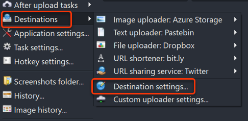
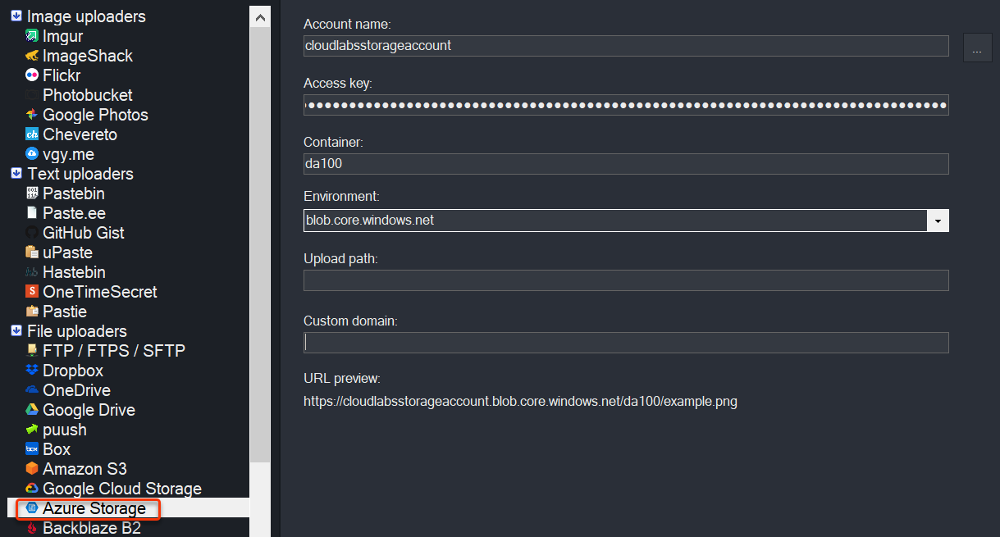
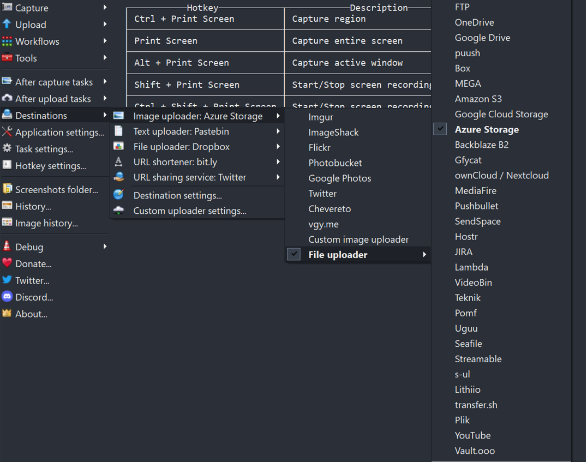
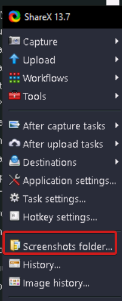
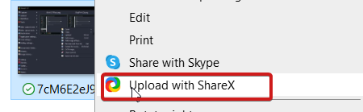

# **Important Instruction to Follow**

Important instruction for grades please do not miss any step

### Task 1: **Connect ShareX with Azure Storage**

In this task we will connect sharex with azure storage for uploading the image

1. Open **ShareX** from the desktop or from task bar.

   

2. To open azure storage click on **Destination** > **Destination Setting** 

     
     
3. Under File uploaders click on **Azure Storage** and provide the Account name, Access key and Container name from environment detail page.
  
   

### Task 2: **Setup Storage Account as Destination**

1. For uploading the images into storage account set the destination, click on **Destination** > **Image uploader:Azure Storage** > **File uploader** > **Azure Storage**

   

### Task 3: **How to Upload Images**

1. Go back to ShareX and click on **Screenshots Folder**

   

2. For uploading images select the image > right click on image and then click on **Upload with ShareX**

   
