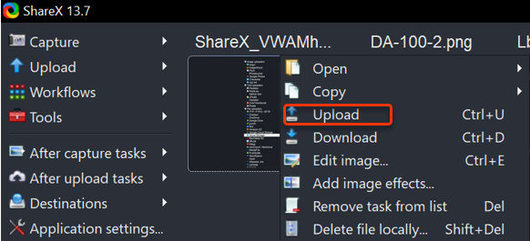

# **Important Instruction to Follow**


### Task 1: **Connect ShareX with Azure Storage**


In this task we will connect sharex with azure storage for uploading the image

1. Open **ShareX** from the desktop or from task bar.

   

2. To open azure storage click on **Destination** > **Destination Setting** 

     
     
3. Under File uploaders click on **Azure Storage** and provide the Account name, Access key and Container name from environment detail page.
  
   


### Task 2: **Setup Storage Account as Destination**


1. For uploading the images into storage account set the destination, click on **Destination** > **Image uploader:Azure Storage** > **File uploader** > **Azure Storage**

   


### Task 3: **How to Upload Images**


1. Before uploading please rename the image as shown below:

```
DID-M1/2/3..

Where,

DID: Deployment ID, you will find deployment id under environment detail page
M: Module number

```

2. For uploading images select the renamed image, right click on it and select **Upload**

   
